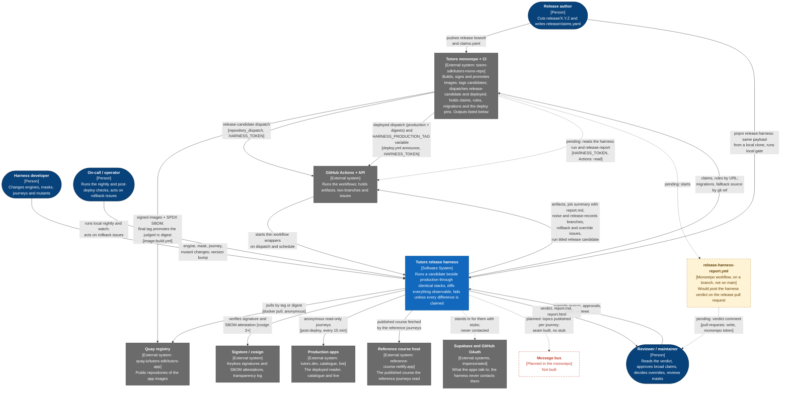

# 1. System context

The harness as one box: who uses it, and which outside systems it depends on or
stands in for. Legend and conventions: [README](README.md#legend).

## Who uses it

| Person | Uses the harness to | How |
| --- | --- | --- |
| Release author | Learn whether every observable difference in the candidate is one they claimed | Writes `release/claims.yaml` in the monorepo; each claim names an artefact, a scope glob, and a `reason` or a `rule` (`claims/README.md`, `docs/monorepo/README.md`) |
| Reviewer / maintainer | Decide whether a candidate ships; keep the gate honest | Reads `report.md` and `report.html`; can override a FAIL only with a written reason of 20+ characters (`--override-reason`, `--override-by`); reviews masks through CODEOWNERS (`.github/CODEOWNERS`); cuts harness releases as tags `v<version>` (`docs/contract.md`, "Compatibility") |
| Harness developer | Change what is captured, compared or gated | Any engine, mask, journey, gate or mutant change must bump the version and re-run the mutants (`src/ci/engine-change.ts`, `TESTING.md`) |
| On-call / operator | Know whether production behaves as the tested candidate did; keep the noise floor honest | `rollback` issues opened by `post-deploy.yml`; `harness local watch` and `harness local nightly` on a machine; `harness doctor` |

The on-call role is inferred from what the code produces (a `rollback` issue,
a loop that never exits on a difference), not from a role named in the code.

## What flows

| From | To | What flows | Where it is defined |
| --- | --- | --- | --- |
| Monorepo | GitHub | `release-candidate` repository dispatch: production and candidate tags, claims URL, `runs: 5`, migration refs, and when available `rules_url`, `production_digests`, `candidate_digests` (four apps each) | monorepo `.github/workflows/release-dispatch.yml` (#310); `docs/contract/workflows.json` |
| Monorepo | GitHub | `HARNESS_PRODUCTION_TAG` set on the harness repository, then a `deployed` dispatch with `production` and `digests` (reader, catalogue, live and time). Sent by `deploy.yml`'s `announce` job after the overlay pins verify and, where reviewers are configured, they approve the `production` environment | monorepo `.github/workflows/deploy.yml` (#298); `.github/workflows/post-deploy.yml` |
| Release author | Harness (locally) | `pnpm release:harness` builds the `release-candidate` payload from a local clone with git alone, and with `--run` hands it to `harness local gate` (`--deployed --run`: `local watch --once`; `--nightly --run`: `local nightly`). It tags, pushes and dispatches nothing | monorepo `scripts/release-harness.ts` (#307) |
| Monorepo | Quay | Multi-arch images per app, tagged `sha-<short>`, `main`, `X.Y.Z-rc.N`; on the final tag the judged rc digest is **retagged** `X.Y.Z`, `X.Y`, `latest`, not rebuilt. Cosign signature by digest; SPDX attestation | `docs/images.md`, section 3; monorepo `image-build.yml`, `scripts/promote-image.ts` (#303) |
| Harness | Quay | `docker pull` of each side's images by tag or `repo@sha256:...`; `docker buildx imagetools inspect` to resolve a tag to a digest | `src/images.ts` |
| Harness | Sigstore | `cosign verify` by digest against the identity of the monorepo's `image-build.yml` and GitHub's OIDC issuer; `cosign verify-attestation` for the SBOM. Needs the network and cosign 3 or newer | `src/images.ts`, `src/image-static/sbom.ts`, `docs/local.md` (N3) |
| Harness | Monorepo | `claims.yaml` and `rules.json` fetched by URL (`curl` in the workflow, `--rules` URL in the CLI); `supabase/migrations` by sparse git fetch; source by `git clone` only in the build-from-ref fallback | `.github/workflows/release.yml`, `scripts/fetch-migrations.sh`, `scripts/build-images.sh` |
| Harness | GitHub | Artifacts (`release-report`, `noise-report`, `mutant-noise-report`, ...); `report.md` appended to the job summary; the `noise` and `release-records` branches; `rollback` and `harness-override` issues. `release.yml` is titled `release <candidate>` (`run-name`) so a caller can find the run a dispatch started | `docs/contract.md` "What the harness does to a pull request"; `docs/contract/workflows.json` (`runNames`); `.github/workflows/release.yml:21` |
| Monorepo (pending) | Harness run | `release-harness-report.yml` finds the `release.yml` run by its title, waits up to 45 minutes, downloads `release-report`, and creates or updates one marked comment on the release PR. Needs `HARNESS_TOKEN` with **Actions: read** on the harness repository, and `pull-requests: write` on the monorepo job. On a monorepo branch (`da7850d`), not on main | monorepo `da7850d:.github/workflows/release-harness-report.yml`; `docs/monorepo/README.md` ("The run is titled for the candidate") |
| Harness | Production apps | Anonymous, read-only requests for the published reference course. Never signs in, never writes | `src/run.ts` (post-deploy branch), `docs/contract.md` |
| Harness | Reference course host | The reader under test fetches `tutors.json` from it during the `reference` journeys, in every mode that runs that set | `traffic/journeys/reference.ts` |
| Harness | Supabase / GitHub OAuth | Nothing is sent. An identity stub and a persistence stub speak their shapes so that signed-in journeys and write attribution work | `fixtures/identity/README.md`, `fixtures/persistence/README.md` |
| Harness | Message bus | Nothing yet: `HARNESS_BUS` unset means `NOT COLLECTED` in the run log and `capture.json`, and no hunk unless `HARNESS_REQUIRE_ARTEFACTS=bus` | `docs/bus.md`, `src/not-collected.ts` |

## What the monorepo produces for the harness

Concrete outputs only; this is not a description of the monorepo. All on
`tutors-mono-repo` `origin/main` (`5d7283e`) unless marked.

| Output | Produced by | The harness uses it as |
| --- | --- | --- |
| Signed, SBOM-attested images, one publisher | `image-build.yml` (the duplicate `images.yml` is gone, #305) | `--a` and `--b` images, verified by digest |
| A promoted release: `X.Y.Z` is the judged `X.Y.Z-rc.N` digest, or `REBUILT` says it is not | `image-build.yml` with `scripts/promote-image.ts` (#303) | what makes the deployed digest equal the judged one, so the release record can match |
| Candidate tags `vX.Y.Z-rc.N` and the `release-candidate` dispatch, with digests, `rules_url` and `runs: 5` | `release-dispatch.yml` (payload by `gh api` and `jq`, #310); locally `pnpm release:harness` (#307) | `--a`, `--b`, `--a-digests`, `--b-digests`, `--claims`, `--rules`, migration refs |
| `release/claims.yaml`, shape-checked against the harness's 19 artefacts; drafts from changed Rules | `pnpm check:release-claims` (#309); `pnpm release:claims:draft` (#301) | `--claims`; a claim names an artefact, a scope and a `reason` or `rule` |
| `rules.json` | `pnpm release:rules` (#308) | `--rules` (`rules_url`); a claim's `rule: "0031"` must be in it |
| `supabase/migrations`, expand/contract checked on the PR | `pnpm check:migrations` (#300) | migration mode reads two refs of it |
| Digest-pinned deploy overlays; `deployed` dispatch with four digests | `pnpm deploy:pin`, `pnpm check:deploy-pins`, `deploy.yml` (#298) | the deployed tag and digests compared with the release record |
| Build identity on `GET /version` only; frozen clock `HARNESS_NOW` | apps (#296) | lets a comparison mask one route instead of chasing the sha |
| JSON logs and `x-request-id` | apps (#297) | the `logs` artefact: JSON-ness, field set, request-id ratio |
| The harness verdict on the release PR (**pending**, on a branch) | `release-harness-report.yml` | reads `release-report` and the run title the harness sets |

## Boundaries worth stating

- **The harness never writes to a pull request, commit status or check.** Its
  workflows hold no `pull-requests`, `checks`, `statuses` or `deployments`
  permission, and a test enforces it. `report.md` is shaped as a PR comment,
  and posting it on the release PR is the monorepo's job with the monorepo's
  token (`docs/contract.md`, "What the harness does to a pull request"). That
  workflow exists but is not on the monorepo's main branch yet, so today nobody
  posts it.
- **The only writes it makes to GitHub** are on this repository: the `noise`
  branch, the `release-records` branch, `harness-override` issues, `rollback`
  issues (`docs/contract/workflows.json`, `writePermissions`).
- **It holds no registry credentials.** The Quay repositories are public and
  the harness pulls anonymously (`docs/monorepo/README.md`). The Quay robot
  account and `HARNESS_TOKEN` are secrets of the monorepo.
- **Production is only read**, and only through the anonymous reference-course
  journeys.
- **Everything except GitHub-hosted publication runs on a laptop** with no
  GitHub (`docs/local.md`). The two dispatches now have a local twin on the
  monorepo side, `pnpm release:harness`, which prints or runs the equivalent.

## Evidence

| Claim | Source |
| --- | --- |
| People and roles | `claims/README.md`; `src/override.ts`; `.github/CODEOWNERS`; `docs/contract.md` (Compatibility, last line); `.github/workflows/post-deploy.yml` |
| External systems | `docs/images.md`; `docs/monorepo/README.md`; `src/run.ts` (post-deploy branch, `externalSide`); `traffic/journeys/reference.ts`; `.github/workflows/*.yml` |
| Stubs stand in, never contacted | `compose.harness.yaml` (identity and persistence services); `fixtures/identity/README.md`; `fixtures/persistence/README.md` |
| Monorepo outputs | `git show origin/main:<path>` in `tutors-mono-repo` at `5d7283e`: `.github/workflows/deploy.yml`, `image-build.yml`, `release-dispatch.yml`; `scripts/promote-image.ts`, `release-harness.ts`, `release-rules.ts`, `release-claims-draft.ts`, `deploy-pin.ts`; `scripts/checks/migrations.ts`, `deploy-pins.ts`, `build-identity.ts`, `release-claims.ts`; `guides/Release-Strategy.md` "Deploy and post-deploy". The report workflow: `git show da7850d:.github/workflows/release-harness-report.yml`, and `git log origin/main..origin/feat/release-dispatch-digests-and-report` shows only that commit |
| Bus planned | `docs/bus.md` ("interface and rule shipped in 1.2.0, disabled until a bus exists"); no `fixtures/bus/` directory exists |
