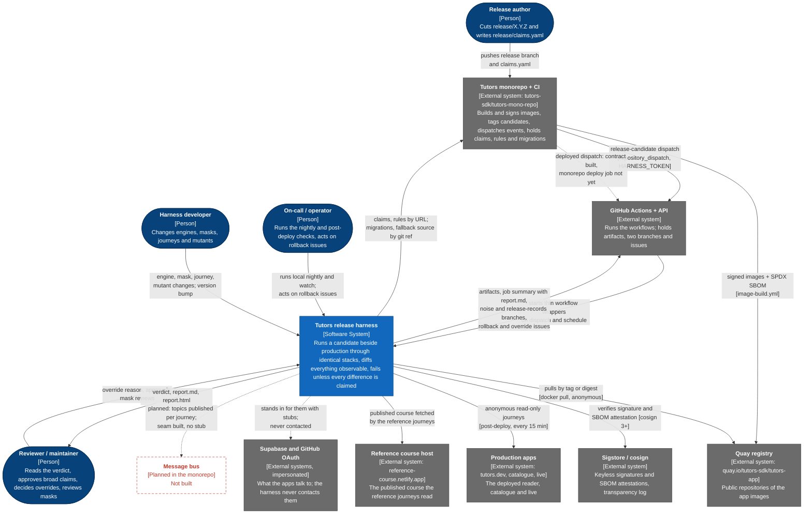

# 1. System context

The harness as one box: who uses it, and which outside systems it depends on or
stands in for. Legend and conventions: [README](README.md#legend).

## Who uses it

| Person | Uses the harness to | How |
| --- | --- | --- |
| Release author | Learn whether every observable difference in the candidate is one they claimed | Writes `release/claims.yaml` in the monorepo; each claim names an artefact, a scope glob, and a `reason` or a `rule` (`claims/README.md`, `docs/monorepo/README.md`) |
| Reviewer / maintainer | Decide whether a candidate ships; keep the gate honest | Reads `report.md` and `report.html`; can override a FAIL only with a written reason of 20+ characters (`--override-reason`, `--override-by`); reviews masks through CODEOWNERS (`.github/CODEOWNERS`); cuts harness releases as tags `v<version>` (`docs/contract.md`, "Compatibility") |
| Harness developer | Change what is captured, compared or gated | Any engine, mask, journey, gate or mutant change must bump the version and re-run the mutants (`src/ci/engine-change.ts`, `TESTING.md`) |
| On-call / operator | Know whether production behaves as the tested candidate did; keep the noise floor honest | `rollback` issues opened by `post-deploy.yml`; `harness local watch` and `harness local nightly` on a machine; `harness doctor` |

The on-call role is inferred from what the code produces (a `rollback` issue,
a loop that never exits on a difference), not from a role named in the code.

## What flows

| From | To | What flows | Where it is defined |
| --- | --- | --- | --- |
| Monorepo | GitHub | `release-candidate` repository dispatch: production and candidate tags, claims URL, optionally rules URL, digests, migration refs, runs | `docs/monorepo/release-dispatch.yml`, `docs/contract/workflows.json` |
| Monorepo | GitHub | `deployed` dispatch: optionally the deployed tag and image digests. **The monorepo has no deploy job that sends it yet**; the harness side is built | `docs/monorepo/README.md`, "First day on Quay" step 5; `.github/workflows/post-deploy.yml` |
| Monorepo | Quay | Multi-arch images per app, tagged `sha-<short>`, `main`, `X.Y.Z`, `X.Y.Z-rc.N`; cosign signature by digest; SPDX attestation | `docs/images.md`, section 3 |
| Harness | Quay | `docker pull` of each side's images by tag or `repo@sha256:...`; `docker buildx imagetools inspect` to resolve a tag to a digest | `src/images.ts` |
| Harness | Sigstore | `cosign verify` by digest against the identity of the monorepo's `image-build.yml` and GitHub's OIDC issuer; `cosign verify-attestation` for the SBOM. Needs the network and cosign 3 or newer | `src/images.ts`, `src/image-static/sbom.ts`, `docs/local.md` (N3) |
| Harness | Monorepo | `claims.yaml` and `rules.json` fetched by URL (`curl` in the workflow, `--rules` URL in the CLI); `supabase/migrations` by sparse git fetch; source by `git clone` only in the build-from-ref fallback | `.github/workflows/release.yml`, `scripts/fetch-migrations.sh`, `scripts/build-images.sh` |
| Harness | GitHub | Artifacts (`release-report`, `noise-report`, ...); `report.md` appended to the job summary; the `noise` and `release-records` branches; `rollback` and `harness-override` issues | `docs/contract.md` "What the harness does to a pull request"; `docs/contract/workflows.json` |
| Harness | Production apps | Anonymous, read-only requests for the published reference course. Never signs in, never writes | `src/run.ts` (post-deploy branch), `docs/contract.md` |
| Harness | Reference course host | The reader under test fetches `tutors.json` from it during the `reference` journeys, in every mode that runs that set | `traffic/journeys/reference.ts` |
| Harness | Supabase / GitHub OAuth | Nothing is sent. An identity stub and a persistence stub speak their shapes so that signed-in journeys and write attribution work | `fixtures/identity/README.md`, `fixtures/persistence/README.md` |
| Harness | Message bus | Nothing yet: `HARNESS_BUS` unset means "not collected" and says so | `docs/bus.md` |

## Boundaries worth stating

- **The harness never writes to a pull request, commit status or check.** Its
  workflows hold no `pull-requests`, `checks`, `statuses` or `deployments`
  permission, and a test enforces it. `report.md` is shaped as a PR comment,
  but posting it on the release PR is the monorepo's job with the monorepo's
  token (`docs/contract.md`, "What the harness does to a pull request").
- **The only writes it makes to GitHub** are on this repository: the `noise`
  branch, the `release-records` branch, `harness-override` issues, `rollback`
  issues (`docs/contract/workflows.json`, `writePermissions`).
- **It holds no registry credentials.** The Quay repositories are public and
  the harness pulls anonymously (`docs/monorepo/README.md`). The Quay robot
  account and `HARNESS_TOKEN` are secrets of the monorepo.
- **Production is only read**, and only through the anonymous reference-course
  journeys.
- **Everything except dispatch, the `deployed` event and GitHub-hosted
  publication runs on a laptop** with no GitHub (`docs/local.md`).

## Evidence

| Claim | Source |
| --- | --- |
| People and roles | `claims/README.md`; `src/override.ts`; `.github/CODEOWNERS`; `docs/contract.md` (Compatibility, last line); `.github/workflows/post-deploy.yml` |
| External systems | `docs/images.md`; `docs/monorepo/README.md`; `src/run.ts` (post-deploy branch, `externalSide`); `traffic/journeys/reference.ts`; `.github/workflows/*.yml` |
| Stubs stand in, never contacted | `compose.harness.yaml` (identity and persistence services); `fixtures/identity/README.md`; `fixtures/persistence/README.md` |
| Bus planned | `docs/bus.md` ("interface and rule shipped in 1.2.0, disabled until a bus exists"); no `fixtures/bus/` directory exists |
| `deployed` sender not built | `docs/monorepo/README.md`, "First day on Quay" |
