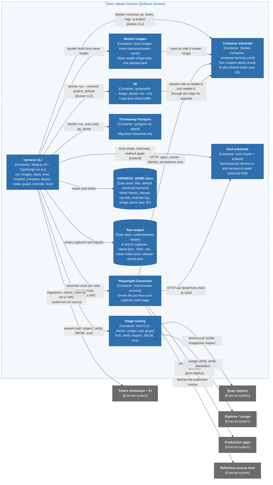
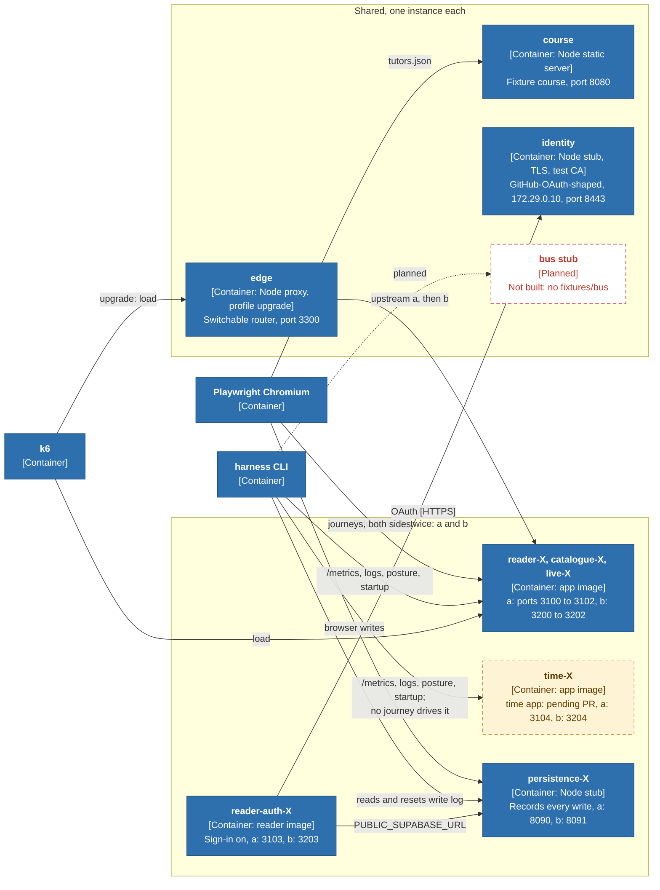
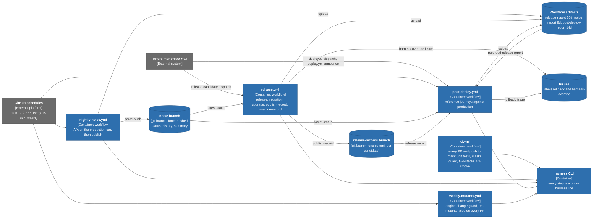
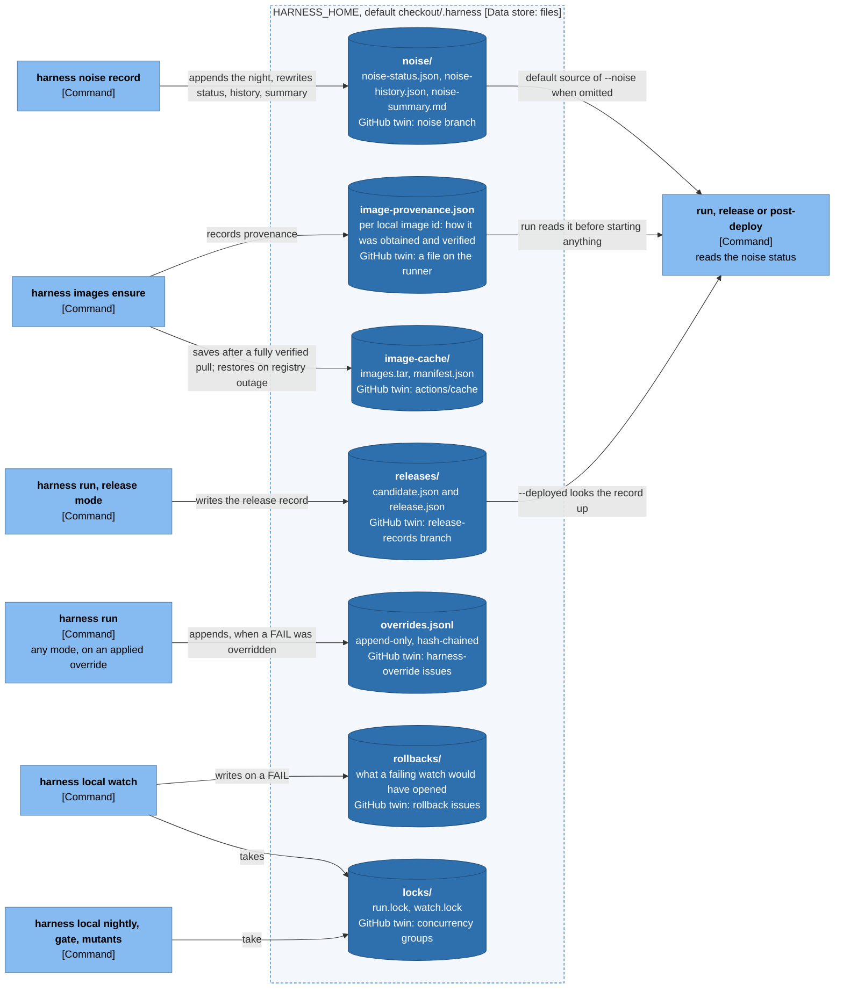

# 2. Containers

The runnable units and data stores. In C4 a *container* is anything that runs
or holds state, not necessarily a Docker container; the technology tag says
which. Four views: what runs on a machine (A), the compose stacks up close (B),
the GitHub side (C), and the state stores (D). Legend:
[README](README.md#legend).

The **time** app is drawn amber and dashed: **time app: pending PR** (built on
`feat/harness-1.2.1-followups`, not in this branch).

## 2A. What runs on a machine (laptop or CI runner)

| Container | Technology | What it holds or does | Source |
| --- | --- | --- | --- |
| harness CLI | Node 22+ (`engines.node`), TypeScript run by `tsx`, launched by `bin/harness.mjs` or `pnpm harness` | Parses arguments, runs the pipeline, pulls and verifies images, drives the substrates, writes reports; also the local ops commands | `src/cli.ts`, `package.json`, `bin/harness.mjs` |
| Compose substrate | `docker compose -p <project> -f compose.harness.yaml`; project `tutors-harness-<8 hex of the checkout path>` | The default substrate: two full stacks and the fixtures they share | `compose.harness.yaml`, `src/stack.ts`, `src/project.ts` |
| kind substrate | kind, kubectl; cluster `tutors-harness-<8 hex>`; two namespaces under `restricted` PSA | The same two sides as Deployments and NodePort Services. Course server runs as a Node process on the host. The signed-in reader and stubs are not in it, so the `auth` journey set is skipped | `src/substrate/kind.ts`, `deploy/kind/README.md` |
| Playwright Chromium | `playwright` ^1.63, `@axe-core/playwright`; the host's Chromium, launched with `--host-resolver-rules=MAP *.harness.test 127.0.0.1` | Runs the six journeys and captures the semantic DOM, screenshot, network, console, headers, axe, focus order and timing | `src/collectors/browser.ts`, `traffic/journeys/` |
| k6 | `grafana/k6:latest` unless `HARNESS_K6_IMAGE` pins it; started per side with `docker run --rm` | Fixed-rate requests at the reader; in upgrade mode, requests through the edge while the candidate is rolled in | `src/collectors/load.ts`, `src/modes/upgrade.ts`, `traffic/load/reader.js` |
| Image tooling | host CLIs `docker`, `cosign` (3+), `syft`, `grype`; each behind an injected `Exec` so tests never start one | Pull, inspect, verify signatures and attestations, generate SBOMs, scan | `src/images.ts`, `src/image-static/` |
| Throwaway Postgres | `postgres:16-alpine` (`HARNESS_POSTGRES_IMAGE`) | Migration mode's schema catalogues, snapshot and rollback rehearsal. Removed afterwards | `src/migration/supabase-postgres.ts` |
| Mutant images | Docker images `tutors-harness/mutant-<name>:latest` built from the base reader image, with `mutants/wrap.mjs` planting an HTTP-edge fault, or a changed base or added package | The harness's own negative fixtures | `src/mutants.ts`, `src/mutant-build.ts`, `mutants/` |
| HARNESS_HOME store | Plain files under `HARNESS_HOME`, default `<checkout>/.harness` | What outlives one run on this machine | `src/local/home.ts` |
| Run output | `out/<UTC timestamp>-<mode>/` | One run's captures and reports | `src/run.ts`, `docs/contract.md` "Output directory" |

## 2B. The compose substrate, up close

Two stacks that differ **only in the image reference**, on one Compose network,
plus the fixtures both sides share. `identity` sits at the fixed address
`172.29.0.10`, which the signed-in readers' `extra_hosts` point `github.com` and
`api.github.com` at.

All of this is one Compose project, `tutors-harness-<8 hex>`, on the network
`172.29.0.0/24`. Side X is drawn once because the two sides are the same service
definitions with a different image and port; `compose.harness.yaml` has the
services `reader-a`, `reader-b`, `persistence-a`, and so on. The shared stubs run
`node:22-bookworm-slim`, read-only, as UID 1001.

What makes the two sides comparable:

- Every app service uses the same YAML anchors (`x-app`, `x-env`, `x-auth-env`),
  so nothing differs but the image (`compose.harness.yaml` header comment).
  `tests/stack.test.ts` holds the two sides to that.
- The **persistence stub is per side**, so a write is attributable to a side.
  The identity, course and edge services are shared.
- Apps run as production does: anonymous mode, read-only root, `tmpfs /tmp`,
  `cap_drop: ALL`, `no-new-privileges`, JSON logs, a frozen `HARNESS_NOW`.
- The reader containers get `HARNESS_PERSISTENCE_URL`, which no app reads; the
  `anon-write` mutant does (`mutants/wrap.mjs`).
- The k6 container joins the project network to reach `reader-a` and `reader-b`
  by service name (`COMPOSE_NETWORK` in `src/stack.ts`).
- Host ports are 13 in this branch (15 with the time app), each with its own
  variable; `--port-offset` on the local commands moves them all.

## 2C. The GitHub side: workflows, branches, artifacts

The workflows are **thin wrappers**: everything they ask of the harness is a
`pnpm harness ...` line, and `tests/local-parity.test.ts` holds those lines to
the plans of the local wrappers. What is not a harness command is plumbing in
shell: `curl` for claims, `gh api` for the noise status and release record,
`git` and `jq` in the `publish-record` job, `gh issue create` for the two
issue labels.

Only four write scopes exist, all on this repository, and a test lists them:
`nightly-noise.yml` `publish` (`contents`, the `noise` branch), `release.yml`
`publish-record` (`contents`, the `release-records` branch), `release.yml`
`override-record` (`issues`), `post-deploy.yml` (`issues`)
(`docs/contract/workflows.json`, `writePermissions`).

## 2D. State stores

What outlives one run, where it lives on a machine, and what stands in for it on
GitHub. Every store on the left has a local home, so nothing exists only inside
a workflow (`docs/local.md`).

| Store | Written by | Read by | Contract status |
| --- | --- | --- | --- |
| `noise/` | `harness noise record` (local nightly; the workflow's `publish` job writes the branch) | release and post-deploy mode (default `--noise`), `harness noise status`, `harness noise history` | file shapes are contract (`noise-status.schema.json`); the store's location is not |
| `releases/` | release mode, always, unless `recordRelease` is off (the mutants) | post-deploy mode, `--deployed <tag>` | `release-record.schema.json` |
| `image-cache/` | `images ensure --image-cache` | `images ensure`, only when the registry cannot answer | not contract |
| `image-provenance.json` | `images ensure`, and `run` for local images | `run`, `stack up`, `kind up`, which refuse an unverified registry image | not contract; `HARNESS_PROVENANCE_FILE` moves it |
| `overrides.jsonl` | any `run` or `compare` whose FAIL was overridden | `harness override list` | not contract |
| `rollbacks/`, `locks/` | `harness local watch`, `harness local ...` | a person; the lock check | not contract |

## Evidence

| Claim | Source |
| --- | --- |
| Containers of 2A, technologies | `src/cli.ts`, `bin/harness.mjs`, `src/stack.ts`, `src/substrate/kind.ts`, `src/collectors/browser.ts` (`launchBrowser`), `src/collectors/load.ts` (`K6_IMAGE`), `src/migration/supabase-postgres.ts` (`PG_IMAGE`), `src/mutants.ts` |
| Compose services, ports, addresses | `compose.harness.yaml` |
| Persistence stub routes | `fixtures/persistence/stub.mjs` (`/_harness/writes`, `/_harness/reset`); `src/persistence/supabase-rest.ts` |
| Edge, profile `upgrade` | `compose.harness.yaml` (`edge`), `fixtures/edge/edge.mjs`, `src/modes/upgrade.ts` |
| Course fetched by the browser, not the apps | `compose.harness.yaml` comment on `course`; `deploy/kind/README.md` |
| Identity routing | `fixtures/identity/README.md`; `src/collectors/browser.ts` (`context.route`) |
| Bus stub not built | `docs/bus.md`; no `fixtures/bus/` |
| time app | `git show feat/harness-1.2.1-followups:compose.harness.yaml` (`time-a`, `time-b`) |
| Workflow triggers, jobs, artifacts, branches | `.github/workflows/*.yml`, `docs/contract/workflows.json` |
| Local state paths | `src/local/home.ts`, `docs/local.md` "Where state lives" |
