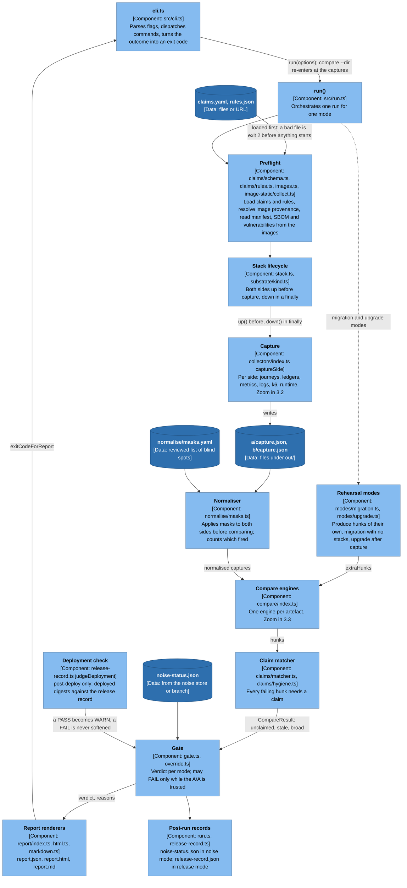
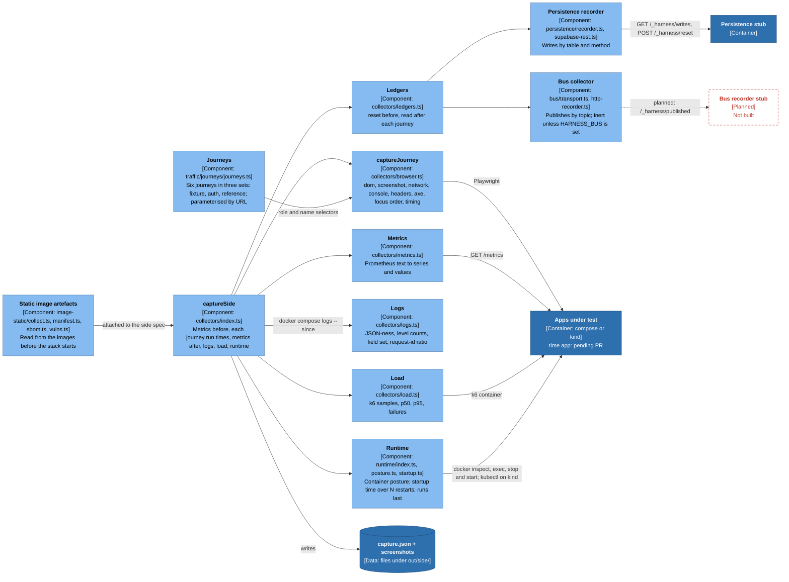
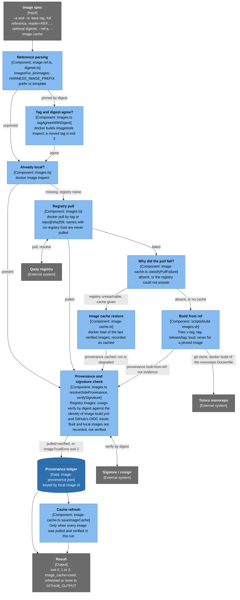
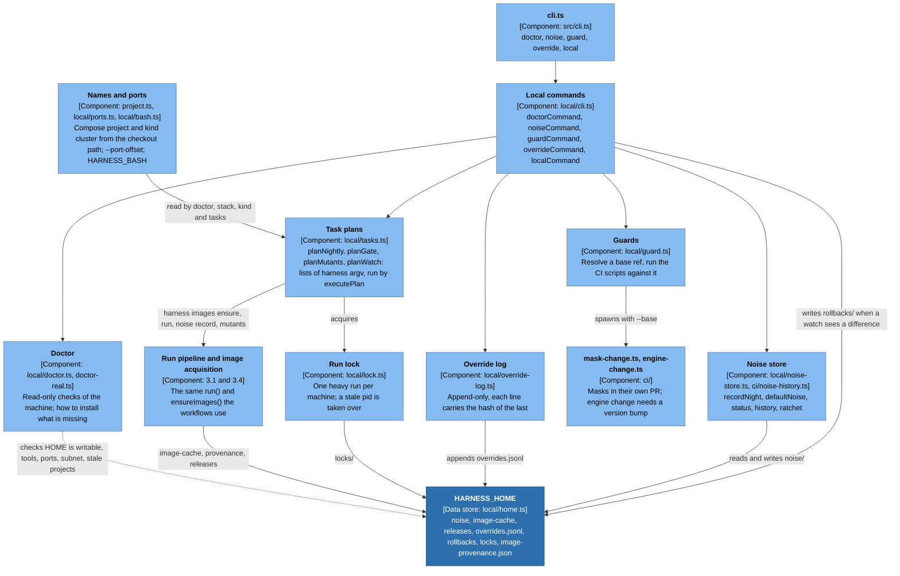

# 3. Components: inside the `harness` CLI

The CLI is the one container with real structure. Five views, each a zoom of
the one before: the run pipeline (3.1), capture (3.2), compare, claim, gate and
report (3.3), image acquisition (3.4), and the local ops layer (3.5). Each
element names the file that implements it. Legend:
[README](README.md#legend).

Amber, dashed: **time app: pending PR** (the `time` app and the corrected
statistics module `src/compare/stats.ts`, built on
`feat/harness-1.2.1-followups`, not in this branch).

## 3.1 The run pipeline

`harness run --mode <mode>` is `run()` in `src/run.ts`. Whatever a mode does to
get its evidence, it ends in the same place: one `CompareResult` of hunks,
matched against claims, judged by `src/gate.ts`, written as `report.json`,
`report.html` and `report.md`.

What each mode does (`src/run.ts`, `docs/modes.md`):

| Mode | Stacks | Evidence | Gate outcome |
| --- | --- | --- | --- |
| `noise` | two, same tag on both sides | captured diffs; refuses if `--a` and `--b` differ | never FAIL. WARN on any failing hunk, or on a clean but degraded run; writes `noise-status.json` |
| `release` | two, production against candidate | captured diffs, k6 with `--load` | FAIL on unclaimed hunks only while the A/A is trusted, else WARN; then writes a release record |
| `any-two` | two, any images | captured diffs | always PASS: investigation only |
| `upgrade` | two plus the edge (profile `upgrade`), compose only | both sides captured once, then k6 through the edge while `b` is rolled in | FAIL on any failed or 5xx request, or `b` never serving |
| `migration` | none: a throwaway Postgres | expand/contract and rollback hunks from two sets of migrations | FAIL on any violation |
| `post-deploy` | none: side b is live production | the release run's recorded `b` capture, filtered to the `reference` journeys, against the same journeys on production | as `release`, plus the deployment check |

Each stage is the same code in every mode. `compareFromCaptures` (normalise,
compare, claim, gate, report) is also what `harness compare --dir` calls on
captures already on disk.

## 3.2 Capture

`captureSide` (`src/collectors/index.ts`) runs once per side. It resets the
write ledgers before each journey and reads them after, so a write is attributed
to the journey that made it. The static image artefacts are read from the
images by `run()` before any stack starts and attached to the capture.

### The collectors

Seventeen artefact names are captured; two more (`migration`, `upgrade`) come
from the rehearsal modes. All nineteen are in `ARTEFACTS` (`src/types.ts:12`).
Load results are reported under `timing` (scope `load/...`).

| Artefact | Collector | Read from | Engine | A difference means |
| --- | --- | --- | --- | --- |
| `dom` | `collectors/browser.ts` | Playwright aria snapshot per page | `engines.ts` `dom`: line diff, hunks | content or structure changed |
| `screenshot` | `browser.ts` | 1280x800, light, reduced motion | `screenshot`: pixelmatch, thresholded by `masks.yaml` | visual change |
| `network` | `browser.ts` | each response: method, path, status, content type, cache headers, JSON shape hash | `network`: multiset of `METHOD url` counts, then per-entry fields | new or missing calls, status, cache or schema change |
| `console` | `browser.ts` | console and page errors | `console`: set diff | a new error or warning |
| `headers` | `browser.ts` | document response headers | `headers`: exact per header | any change |
| `axe` | `browser.ts` | axe-core, WCAG 2.1 A and AA | `axe`: set diff by rule and target | a new violation |
| `focus` | `browser.ts` | what each successive Tab focuses | `extra.ts` `focus`: ordered sequence diff | a focus stop lost or reordered |
| `timing` (pages) | `browser.ts` | Playwright request timing: TTFB and journey duration | `engines.ts` `timing`: Mann-Whitney U, needs `minRuns` | slower beyond noise |
| `metrics` | `metrics.ts` | `/metrics` before and after | `metrics`: series presence and counter deltas | a missing or new series, a counter that moved differently |
| `logs` | `logs.ts` | container logs since capture began (compose only) | `logs`: aggregate | log shape or volume changed |
| `persistence` | `ledgers.ts`, `persistence/` | per-side stub | `extra.ts` `persistence` through `ledger.ts` | writes differ; **any** write in an anonymous journey |
| `bus` | `bus/` | a transport, if `HARNESS_BUS` is set | `extra.ts` `bus` through `ledger.ts` | publishes differ; any publish in an anonymous journey |
| `timing` (load) | `load.ts` | k6 JSON output | `extra.ts` `load`: failure rate, p95 shift, Mann-Whitney on samples | latency or errors regressed under load |
| `image-manifest` | `image-static/manifest.ts` | `docker image inspect` | `compare/image-static.ts`: exact per field, size with a tolerance | a different base, a root user, a port or command |
| `sbom` | `image-static/sbom.ts` | cosign attestation, or a local generator | `image-static.ts`: set diff on `name@version` | a package added, removed or bumped |
| `vulns` | `image-static/vulns.ts` | a scanner over that SBOM, database pinned | `image-static.ts`: set diff by advisory | a vulnerability new on b |
| `runtime` | `runtime/posture.ts` | declared (`docker inspect` or pod spec) and measured (a probe inside the container) | `compare/runtime.ts`: exact per field | a changed user, capability, writable root or mount |
| `startup` | `runtime/startup.ts` | restart each app N times, time to first healthy response and to the orchestrator's ready verdict | `runtime.ts`: Mann-Whitney U with a millisecond floor | a slower boot; an app that stops coming up |

Behaviours worth knowing:

- Only the first run of a journey produces screenshots, axe and focus. Later
  runs exist for the timing samples.
- `runtime` and `startup` **fail** when they cannot be collected
  ("not collected" is a failing, claimable hunk), so a missing collector cannot
  read as a clean one. The static image artefacts report "not collected" as
  informational unless `HARNESS_REQUIRE_STATIC=1` makes it fail
  (`docs/images.md`, section 8).
- Post-deploy skips metrics, logs, runtime, startup, load and persistence: a live
  deployment is not the harness's to read (`captureSide`, `spec.external`).
- Nothing is retried anywhere. A noisy result is investigated, not re-run.

## 3.3 Compare, claim, gate, report

```mermaid
flowchart LR
  norm["<b>Normaliser</b><br/>[Component: normalise/masks.ts]<br/>Both sides masked identically"]:::component
  cmp["<b>compareCaptures</b><br/>[Component: compare/index.ts]<br/>Runs every engine in a fixed order; deterministic"]:::component
  eng["<b>Page and side engines</b><br/>[Component: compare/engines.ts, extra.ts]<br/>dom, screenshot, network, console, headers, axe, focus, metrics, logs, timing, load"]:::component
  led["<b>Ledger rule</b><br/>[Component: compare/ledger.ts]<br/>Sides must agree; an anonymous journey may write nothing. Shared by persistence and bus"]:::component
  img["<b>Image engines</b><br/>[Component: compare/image-static.ts, runtime.ts]<br/>image-manifest, sbom, vulns, runtime, startup"]:::component
  mw["<b>Mann-Whitney U</b><br/>[Component: compare/engines.ts:252 today]<br/>time app: pending PR: replaced by compare/stats.ts"]:::pending
  match["<b>matchClaims</b><br/>[Component: claims/matcher.ts]<br/>First matching claim in file order; artefact plus scope glob"]:::component
  hyg["<b>claimHygiene</b><br/>[Component: claims/hygiene.ts]<br/>Reports broad or greedy claims; never gates"]:::component
  gate["<b>gate()</b><br/>[Component: gate.ts]<br/>Verdict and reasons for the mode"]:::component
  trust["<b>trustNoise</b><br/>[Component: gate.ts]<br/>Waived, or a status that is clean, not degraded, at most 7 days old"]:::component
  ovr["<b>Override</b><br/>[Component: override.ts]<br/>Reason of 20+ characters and a person; verdict stays FAIL, exit becomes 0"]:::component
  rep["<b>writeReports</b><br/>[Component: report/index.ts]<br/>json, html, markdown, with provenance, deployment and image sections"]:::component
  ns["<b>noise-status.json</b><br/>[Data: file]<br/>clean, hunks, degraded"]:::store
  exit["<b>Exit code</b><br/>[Component: override.ts exitCodeForReport]<br/>0 pass, warn or overridden fail; 1 fail; 2 usage or cannot judge"]:::component

  norm --> cmp
  cmp --> eng
  cmp --> img
  eng -->|"persistence, bus"| led
  eng -->|"timing, load"| mw
  img -->|"startup"| mw
  eng -->|"hunks"| match
  led -->|"hunks"| match
  img -->|"hunks"| match
  mw -->|"p-value decides fail or info"| match
  match -->|"CompareResult"| hyg
  match -->|"unclaimed, stale, broad without approvedBy"| gate
  trust -->|"release and post-deploy only"| gate
  gate -->|"verdict"| ovr
  ovr --> rep
  rep --> exit
  gate -->|"noise mode"| ns

  classDef component fill:#85bbf0,stroke:#5d82a8,color:#000000
  classDef store fill:#2e6fae,stroke:#1f4d7a,color:#ffffff
  classDef pending fill:#fff3d6,stroke:#b7791f,color:#5c3d00,stroke-dasharray:6 4
```

**Hunks.** An engine emits `Hunk`s (`src/types.ts`): an artefact, a scope, a
severity (`fail` or `info`) and a summary. Only `fail` hunks need a claim.
Improvements (a fixed axe violation, a console message gone, a vulnerability
fixed) are `info`.

**Claims.** `matchClaims` assigns each failing hunk to at most one claim, the
first that matches in file order. A claim matches on artefact (or `*`) and a
`picomatch` glob against the hunk's scope, its path, or the part of its scope
before the first `/`. The result is `unclaimed` (what gates), `staleClaims`
(matched nothing, reported, never gates) and `broadUnapproved` (artefact `*` or a
scope like `**` without `approvedBy`, which does gate). A claim carries a
`reason`, or since 1.3.0 a `rule: "0031"` that the release's `rules.json` must
contain; a claim naming a rule that is not there stops the run with exit 2
before any stack starts.

**The gate** (`gate.ts`), per mode:

| Mode | pass | warn | fail |
| --- | --- | --- | --- |
| `noise` | no failing hunk and not degraded | a failing hunk, or clean but degraded | never |
| `any-two` | always | never | never |
| `release`, `post-deploy` | no unclaimed hunk and no unapproved broad claim | the same findings, when the A/A is not trusted; text starts "advisory only" | those findings, when the A/A is trusted |
| `migration`, `upgrade` | no violation | never | any violation; needs no A/A |

`trustNoise` returns true when `--noise skip` waived it, or when a status is
present, has no `degraded`, is `clean`, and is no older than
`noiseMaxAgeDays` (default 7). **The noise-status rule is the harness's licence
to fail: without it the same findings are a warning with the reason stated.**

**Exit codes** (`docs/contract.md`): 0 for pass, warn, or a FAIL overridden with a
reason and a person; 1 for a FAIL; 2 for a usage error, a harness error, or an
image that may not be judged (`ImageTrustError`, `cannot judge:`).

## 3.4 Image acquisition: `harness images ensure`

The one place the harness touches source, and only to produce an image it then
treats like any other. Run before `run`; `run` itself refuses an image that is
absent or unverified, so compose never pulls one silently.

Provenance values (`src/types.ts`, `docs/images.md` section 7):

| Provenance | Meaning | Counts as evidence for a release |
| --- | --- | --- |
| `pulled+verified` | pulled from a registry, signature verified by digest against the monorepo's workflow identity | yes |
| `pulled-unverified` | pulled, verification failed, `--allow-unsigned` given | no; the report says so |
| `cached` | restored from the image cache because the registry could not be reached | no; the run is degraded |
| `built-from-ref` | built here from a monorepo ref | no; "it is not the image that ships" |
| `local` | already present, not from a registry (mutants, `tutors/<app>:local`) | recorded as unverified |

Decisions the diagram encodes:

- **A tag the registry says does not exist never borrows a cache.**
  `classifyPullFailure` separates "absent" (falls through to build-from-ref) from
  "unreachable" (may use the cache).
- **A pinned image is never built from source**: a rebuild is not the image the
  digest names.
- **Verification is by digest, never the tag**, which could move between pull
  and check.
- **The cache is only ever written from images pulled and verified in the same
  run**, so an unverified image can never enter it.
- Exit codes: 0 every image may be judged; 1 an image could not be obtained; 2 an
  image may not be judged (unsigned, wrong identity, cosign missing or older than
  3, a moved tag). 2 wins when both occur.

## 3.5 The local ops layer

What lets everything run on a laptop with no GitHub. The workflows call the same
`harness` commands; `tests/local-parity.test.ts` holds the two to the same plans.

The four tasks, each planned as the workflow's own commands (`--dry-run` prints
the plan and starts nothing):

| Task | Steps | Workflow it mirrors |
| --- | --- | --- |
| `harness local nightly` | `images ensure --image-cache`, `run --mode noise --require-verified`, `noise record` | `nightly-noise.yml` |
| `harness local gate` | `noise status`, `images ensure`, then release, migration and upgrade runs as separate streams: a FAIL in one does not hide the others; writes `gate.md` and `gate.json` | `release.yml` |
| `harness local mutants` | `images ensure`, `mutants --base` | `weekly-mutants.yml` |
| `harness local watch` | `run --mode post-deploy` once or every 15 minutes; a difference writes `rollbacks/<time>-rollback.md`; never exits on a difference; needs no Docker | `post-deploy.yml` |

The local store is this machine's calibration: the noise floor of a laptop's
Chromium is not a Linux runner's, so the same rule (clean, verified, at most
seven days) applies to the store, and a CI status must not be copied into it
(`docs/local.md`, "The noise store is this machine's calibration").

## Evidence

| Claim | Source |
| --- | --- |
| Pipeline order, preflight before stacks, `finally` teardown | `src/run.ts:249-364` |
| `compareFromCaptures` order: normalise, compare, claims, noise, gate, deployment, override, hygiene, reports | `src/run.ts:147-202` |
| Mode behaviours | `src/run.ts:260-283`, `src/modes/`, `docs/modes.md`, `src/gate.ts` |
| `captureSide` steps | `src/collectors/index.ts` |
| Artefact list | `src/types.ts:12` |
| Engines and their rules | `src/compare/engines.ts`, `extra.ts`, `ledger.ts`, `image-static.ts`, `runtime.ts` |
| Not collected: runtime and startup fail, image-static informational | `src/compare/runtime.ts:141,200`; `src/compare/image-static.ts` (`staticRequired`); `docs/images.md` section 8 |
| Claim matching | `src/claims/matcher.ts`, `src/claims/schema.ts`, `src/claims/rules.ts` |
| Gate and `trustNoise` | `src/gate.ts` |
| Override | `src/override.ts` |
| Image acquisition | `src/images.ts:352-517`, `src/image-cache.ts`, `src/image-ref.ts`, `src/digests.ts`, `scripts/build-images.sh` |
| Local layer | `src/local/*`, `src/project.ts`, `docs/local.md`, `tests/local-parity.test.ts` |
| Statistics pending | `git show feat/harness-1.2.1-followups:src/compare/stats.ts`; `docs/releases/1.3.0.md` on that branch |
