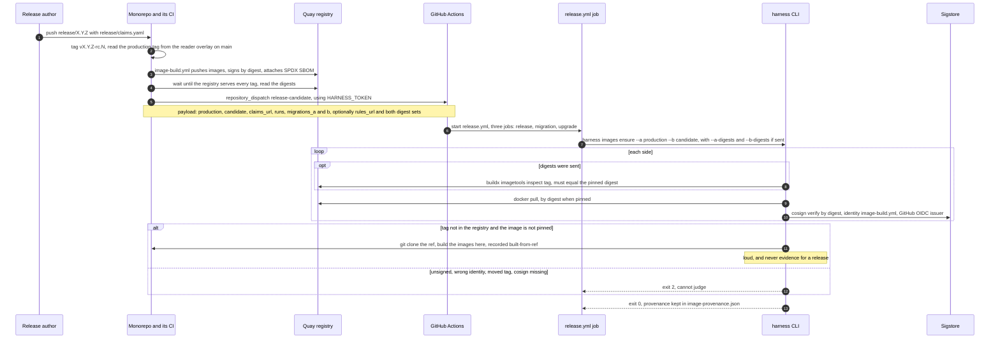
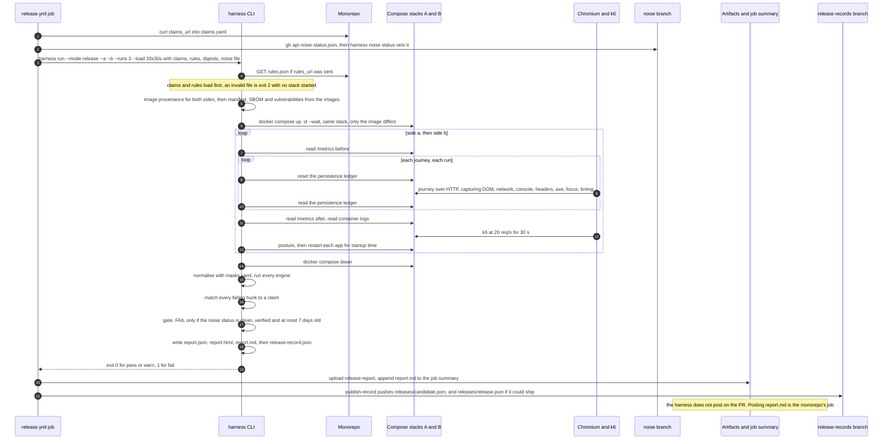
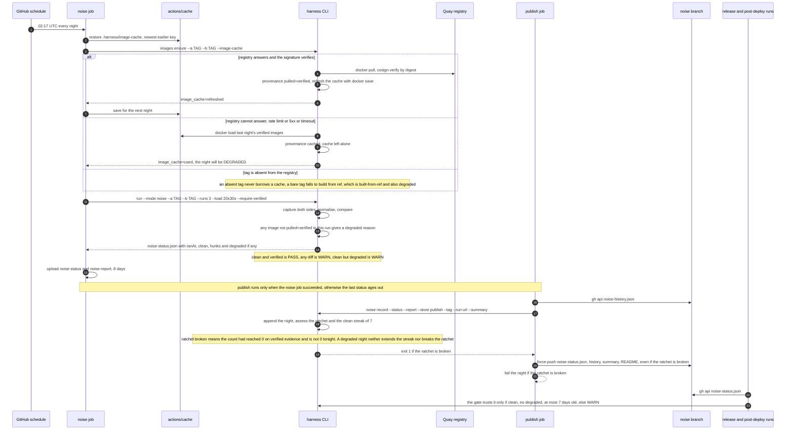
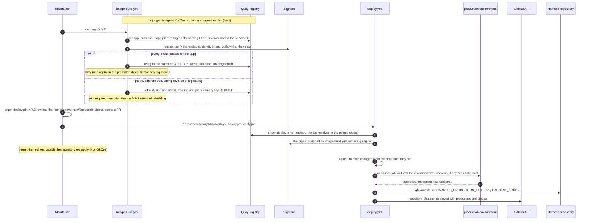
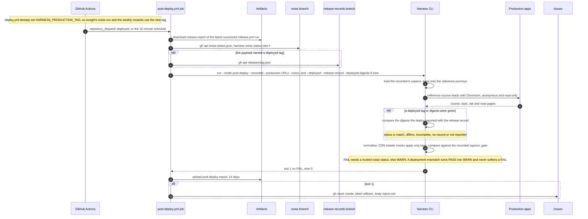
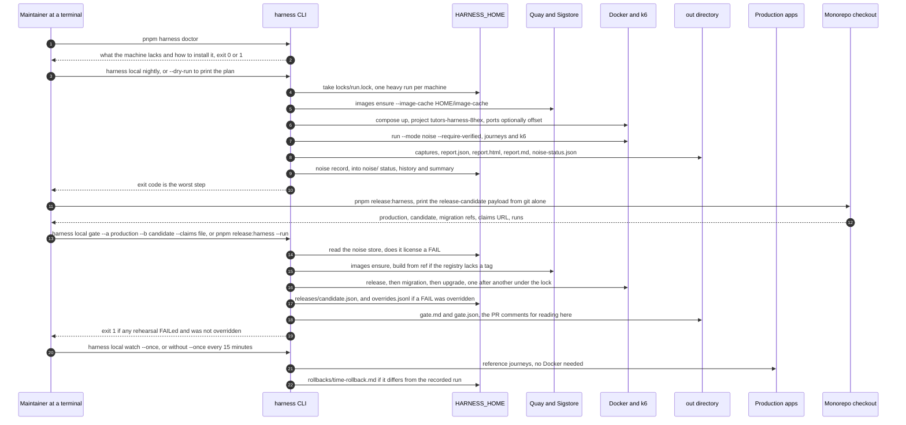

# 4. Dynamic views

Four scenarios as sequence diagrams (4c is two diagrams). Everything drawn is
built; the monorepo side was read from its `origin/main` at `c14c3ee`
(`deploy.yml`, `image-build.yml` promotion, `pnpm release:harness`). Legend and
conventions: [README](README.md#legend).

Where a default changes when the pending PR lands, it is in the notes:
**time app: pending PR** adds the `time` app to every stack and image step, and
raises the `--runs` default of the nightly and release workflows from 3 to 5
(see the [README](README.md#what-pending-pr-contains)).

## 4a. A release candidate, end to end

Two diagrams: from the push to the verified images, then from the images to the
verdict and the release record.

### 4a-1. Dispatch and image acquisition

Two things about the monorepo side of this diagram:

- `release-dispatch.yml` builds the payload with `gh api` and `jq`. The same
  payload can be built from a local clone with `pnpm release:harness` (#307),
  which reads git only and dispatches nothing; a monorepo test holds the two to
  the same fields and order. `rules_url` points at the `rules.json` that
  `pnpm release:rules` (#308) writes.
- The candidate's image built here, `X.Y.Z-rc.N`, is the one that ships. On the
  final tag `image-build.yml` promotes its digest (see 4c-1).

### 4a-2. Capture, compare, claim, gate, record

Notes:

- The `migration` and `upgrade` jobs run alongside the `release` job on separate
  runners. `migration` fetches migrations from two monorepo refs and needs no
  images. `upgrade` runs its own `images ensure`, then rolls `b` in through the
  edge under load.
- `publish-record` runs whenever `release` did not skip; a run that never
  reached a verdict left no record and that is not an error. A record for a
  candidate is written whatever its verdict. The record under the release's own
  name (`16.3.0.json`) is only the newest candidate that could ship (verdict not
  FAIL, or a FAIL that was overridden).
- With `override_reason` given on a manual dispatch, the verdict stays FAIL, the
  job exits 0, and `override-record` opens a `harness-override` issue. A
  `repository_dispatch` payload cannot override.

## 4b. The nightly A/A and the noise ratchet, including the degraded path

The harness may only FAIL a release while the latest nightly A/A is clean,
verified and at most seven days old. This is how that status is produced.

Points a maintainer needs:

- The status is published even when dirty or degraded, so a bad night
  **supersedes** an older clean one. A clean night from last week never stands in
  for a dirty one since (`docs/contract.md`).
- A degraded night does not count in either direction. Release runs then only
  warn until a verified clean night is published.
- Statistics: with three runs a side the timing engine cannot reach alpha 0.05.
  The pending PR fixes the Mann-Whitney function and moves the nightly to five
  runs. Reports and A/A history from before it are not evidence about the
  corrected engines (`docs/releases/1.3.0.md` on `feat/harness-1.2.1-followups`).

## 4c. From the judged candidate to production, and the post-deploy check

Two diagrams: the monorepo's path from the judged rc to a `deployed` event
(built, on `origin/main`), then the harness's response.

### 4c-1. Promote, pin, verify, announce

- **The released digest equals the judged rc digest** for every app that was
  promoted, so the digest in the overlays, the digest in the `deployed` payload
  and the digest the harness recorded in the release record are the same bytes.
  A `REBUILT` app breaks the equality, and then post-deploy's journeys are the
  only check that production behaves like the judged image
  (`guides/Release-Strategy.md`, "Pinned digest equals judged digest").
- **Where the digests come from.** `deploy.yml` sends the digests the overlays
  pin, after checking them against the registry and the signature. It does not
  read a digest off a running cluster, because the rollout is outside the
  repository.
- **Only three digests are sent.** The payload's `digests` is built from
  `reader`, `catalogue` and `live`. Once the `time` app is in the harness stack
  (pending PR), the release record will hold a `time` digest too, and
  `judgeDeployment` treats "the record has a digest and the deploy reported none"
  as a gap: status `incomplete`, a warning. This is inferred from
  `deploy.yml`'s `jq` expression and `src/release-record.ts:172`; no run
  confirmed it. Either the monorepo sends `time` or the harness ignores it.

### 4c-2. The post-deploy run

The every-15-minutes schedule runs the same job with no payload; only a
`deployed` dispatch carries a tag and digests to check.

What the digest comparison establishes: `judgeDeployment` compares the digests
**the deploy job reported** (the verified overlay pins) with the digests
**release mode recorded**. The harness does not read a digest off production, so
this catches a deploy that pins something other than what was judged, not a
cluster that runs something other than what was pinned (`src/release-record.ts`).

## 4d. A purely local run, from a laptop with no GitHub

Nothing here needs GitHub: no dispatch, no branch, no artifact. The network is
needed only to pull from Quay and to verify with Sigstore, and not at all when
both sides are local builds (`--a local --b local`, `docs/images.md` section 6).

What differs from CI, all by design (`docs/local.md`):

- The noise store is **this machine's** calibration. A laptop's Chromium has a
  different noise floor from a Linux runner's, so a CI `noise-status.json` must
  not be copied in. The same rule applies to it: clean, verified, at most seven
  days.
- The three release jobs run one after another under a run lock, because they
  share one compose project, its ports and its subnet.
- Nothing is posted anywhere: `gate.md` is read in place, and
  `gh pr comment <n> --body-file` is the manual step.
- A registry outage is survived from `HARNESS_HOME/image-cache`, and the night is
  degraded, exactly as in CI.
- **The local trigger now exists, on the monorepo side.** `pnpm release:harness`
  (#307) builds the dispatch payload from a local clone and, with `--run`, calls
  `local gate`; `--deployed --run` calls `local watch --once` with
  `HARNESS_PRODUCTION_TAG` set; `--nightly --run` calls `local nightly`. It tags,
  pushes and dispatches nothing, so a candidate the registry lacks is built from
  its tag by the harness (not evidence) unless the tag was pushed first. The
  monorepo checkout and the harness checkout sit side by side, or `HARNESS_DIR`
  names the harness.

## Evidence

| Diagram | Source |
| --- | --- |
| 4a-1 | `docs/monorepo/release-dispatch.yml` (jobs `candidate`, `images`, `dispatch`); `.github/workflows/release.yml` (steps up to "Pull and verify"); `src/images.ts`; `docs/images.md` |
| 4a-2 | `.github/workflows/release.yml`; `src/run.ts:249-364`; `src/collectors/index.ts`; `src/gate.ts`; `src/release-record.ts`; `docs/contract.md` "What the harness does to a pull request" |
| 4b | `.github/workflows/nightly-noise.yml`; `src/images.ts` (`ensureImages`); `src/image-cache.ts`; `src/run.ts` (`evidenceGaps`); `src/gate.ts`; `src/ci/noise-history.ts` (`assess`, `record`); `docs/noise-burndown.md` |
| 4c-1 | monorepo `.github/workflows/image-build.yml`, `scripts/promote-image.ts` (#303), `scripts/deploy-pin.ts`, `scripts/checks/deploy-pins.ts`, `.github/workflows/deploy.yml` (#298), `guides/Release-Strategy.md` "Deploy and post-deploy" |
| 4c-2 | `.github/workflows/post-deploy.yml`; `src/run.ts:267-283, 367-372`; `src/release-record.ts` (`judgeDeployment`); `normalise/masks.yaml` (`modes: [post-deploy]`) |
| 4d | `docs/local.md`; `src/local/cli.ts`, `tasks.ts`, `lock.ts`, `home.ts`; monorepo `scripts/release-harness.ts` |
