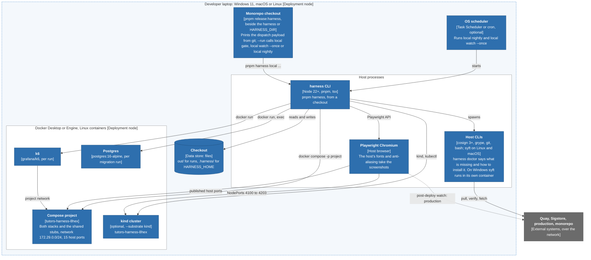
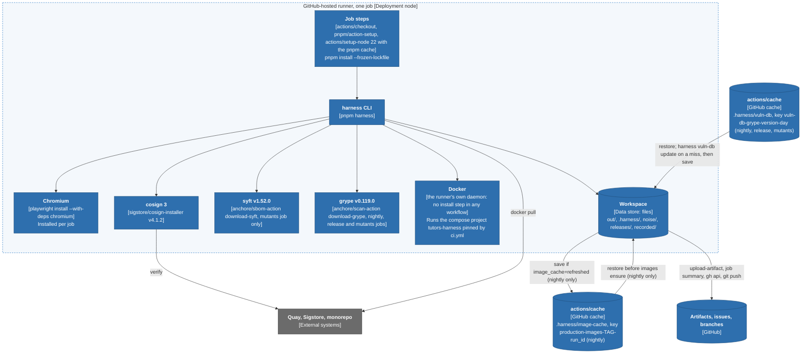
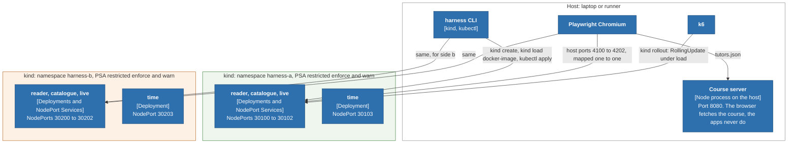

# 5. Deployment

Where the harness runs and where its state and secrets live. There are three
places it runs: a laptop, a GitHub-hosted runner, and a kind cluster that stands
in for a real cluster. Legend: [README](README.md#legend).

**OpenShift is out of scope.** The harness does not deploy to, test on, or
rehearse OpenShift. `docs/local.md` says so in its second paragraph: "OpenShift
is out of scope. The compose and kind substrates are what runs." The kind
substrate stands in for a cluster with the same admission policy and nothing
more (5C).

The harness deploys nothing to production. Its own "deployment" is a checkout
plus Docker. The monorepo deploys production: its overlays are pinned by digest,
the promoted digest is the one the harness judged, and its OpenShift variants
(`deploy/k8s/variants/openshift`) belong to the monorepo's own conformance check,
not to this harness. What reaches the harness from that deployment is the
`deployed` event (4c-1 in [04-dynamic.md](04-dynamic.md)).

## 5A. A laptop

**The compose project name is derived from the checkout path.**
`tutors-harness-<first 8 hex of sha256(real path of the checkout)>`, lowercased
on Windows, so two checkouts or git worktrees of the harness on one machine get
two names and never replace each other's stack (`src/project.ts`). Overrides,
most specific first: `HARNESS_COMPOSE_PROJECT`, `HARNESS_PROJECT`. The plain name
`tutors-harness` is the legacy default from before contract 1.3.0; it may be the
machine owner's, and no command adopts or removes it (`harness doctor` reports
it as "not touched", and `harness kind up` and `down` refuse a cluster of that
name). A run only ever runs `docker compose -p <its own project>` and touches its
own kind namespaces.

**Keeping the laptop tidy and current.** `harness vuln-db update` fetches the one
grype database into `HARNESS_HOME/vuln-db` (`harness doctor` warns when it is
older than `HARNESS_VULN_DB_MAX_AGE_DAYS`, default 5); `harness prune` frees old
`out/` run directories and an old image cache (a dry run unless `--yes`);
`harness local smoke` boots both stacks and runs one journey A/A plus the
migration fixtures.

**Running the release flow from a laptop.** The monorepo's `pnpm release:harness`
(#307) is the local trigger: it reads git only (the reader overlay on
`origin/main`, tags, the release branch), builds the same `release-candidate`
payload `release-dispatch.yml` sends, and with `--run` starts `harness local gate`.
The harness checkout needs `pnpm install` and `pnpm harness doctor` to pass. It
never tags, pushes or dispatches, so push the candidate tag first or the harness
builds the candidate from the ref (not evidence).

**Ports.** Fifteen host ports, each with its own variable; `--port-offset N` on
`harness local ...` and `harness doctor` moves them all, and a variable you set
yourself wins. The compose subnet is **not** configurable, so two harness stacks,
or any Docker network on `172.29.0.0/24`, cannot coexist. A run lock serialises
runs on one machine.

| Ports | Default |
| --- | --- |
| course, identity, edge | 8080, 8443, 3300 |
| side a: reader, catalogue, live, reader-auth, persistence | 3100, 3101, 3102, 3103, 8090 |
| side b: reader, catalogue, live, reader-auth, persistence | 3200, 3201, 3202, 3203, 8091 |
| time-a, time-b | 3104, 3204 (15 ports in all) |
| kind NodePorts, host side, fixed in `deploy/kind/kind-config.yaml` | 4100 to 4103 and 4200 to 4203 |

Two clusters from two checkouts cannot run at once, because every cluster made
from `kind-config.yaml` maps the same host ports.

**Docker Desktop notes** that shape the deployment (`docs/local.md`):
Linux containers only (WSL 2 backend on Windows); its VM clock drifts after sleep
and breaks pulls and signature checks, which `harness doctor` compares against the
host; `bash` must be Git's, not WSL's launcher, for the two scripts that need it
(`HARNESS_BASH`); the harness starts children with `MSYS_NO_PATHCONV=1`.

## 5B. A GitHub-hosted runner

- **A pinned runner image.** `nightly-noise.yml`, and the `release` job of
  `release.yml`, and `post-deploy.yml` run on `ubuntu-24.04`, not
  `ubuntu-latest`, because the nightly A/A measures the noise floor of that
  runner image (fonts, anti-aliasing, timing). The three move together, in one PR,
  followed by a fresh noise burn-down (comments in the workflows, and
  `docs/noise-burndown.md`). The migration, upgrade, publish, CI and mutants jobs
  use `ubuntu-latest`.
- **Caches.** `pnpm` through `setup-node`; the production images through
  `actions/cache` for the nightly only, restored with `restore-keys` so the newest
  earlier night is found, and saved only when `images ensure` reports
  `image_cache=refreshed`; and one vulnerability database, one entry per UTC day
  and grype version, restored by the nightly, the release job and the mutants,
  fetched once on a miss, and never updated during a run.
- **State is thrown away with the runner.** The provenance ledger, `out/` and the
  workspace are gone afterwards. What must outlive a job goes to an artifact
  (8 to 30 days), the `noise` branch, the `release-records` branch, or an issue.
- **One checkout per runner.** `ci.yml` pins `HARNESS_COMPOSE_PROJECT=tutors-harness`
  because a runner holds one checkout.
- **No registry credentials.** The images are public and pulled anonymously.
- **Vulnerability scanning.** The nightly, the release job and the weekly mutants
  install grype at a pinned version, and print `harness vuln-db status` before
  judging. The nightly and the release job set `HARNESS_REQUIRE_STATIC=1`, so a
  scanner that cannot run makes the night not clean and a release not judged;
  the mutants do not. The harness's release notes list "no run has yet shown
  the cache hit" as pending validation (`docs/releases/1.4.0.md`).

## 5C. kind: a stand-in for a cluster

Not in kind: the signed-in reader, the identity and persistence stubs, and the
edge. The `auth` journey set is skipped. The time app is published on host ports
4103 and 4203 (`deploy/kind/kind-config.yaml`).

- **Why restricted PSA.** OpenShift's restricted SCC requires a non-root
  arbitrary UID, no privilege escalation, dropped capabilities and a
  runtime-default seccomp profile. `restricted` Pod Security Admission requires the
  same set. The manifests carry the same security context as the monorepo's
  kustomize base, so a release that passes here would pass admission there
  (`deploy/kind/README.md`).
- **What it does not rehearse:** Routes, the OpenShift router's headers, and the
  arbitrary-UID **assignment** (kind runs the image's own UID). A boot probe as a
  random UID is named "not built yet" in `docs/modes.md`. **This is why OpenShift
  is out of scope: nothing here is OpenShift.**
- **Images:** never pulled by the cluster (`imagePullPolicy: IfNotPresent`), always
  loaded by `kind load docker-image` after `images ensure`; a digest-pinned image
  is loaded under a local tag derived from its digest.
- **The upgrade rehearsal** on kind is a real `RollingUpdate` (`maxUnavailable: 0`,
  `maxSurge: 1`) run with `harness kind rollout`, not part of `harness run --mode
  upgrade`, which is compose-only.
- **`kind down`** deletes the namespaces; the cluster stays until
  `kind delete cluster --name <name>`.

## 5D. Where each store and secret lives

### Stores

| Store | On a laptop | In CI |
| --- | --- | --- |
| Run output | `<checkout>/out/<timestamp>-<mode>/` (`--out`) | the runner's workspace, uploaded as an artifact (7 to 30 days) |
| Noise status and history | `HARNESS_HOME/noise/` | the `noise` branch, force-pushed nightly; the status also as a `noise-status` artifact for 8 days |
| Release records | `HARNESS_HOME/releases/` | the `release-records` branch, one commit per candidate; also inside the `release-report` artifact |
| Image cache | `HARNESS_HOME/image-cache/` | `actions/cache`, path `.harness/image-cache` |
| Provenance ledger | `HARNESS_HOME/image-provenance.json` (`HARNESS_PROVENANCE_FILE` moves it) | a file on the runner, lost with it |
| Override record | `HARNESS_HOME/overrides.jsonl`, hash-chained | `harness-override` issues on this repository |
| Rollback record | `HARNESS_HOME/rollbacks/` | `rollback` issues on this repository |
| Run locks | `HARNESS_HOME/locks/` | `concurrency:` groups |
| Masks, journeys, fixtures, mutants | this repository | this repository |
| Claims, rules | the monorepo checkout (`--claims`, `--rules`) | fetched by URL from the monorepo |

`HARNESS_HOME` defaults to `<checkout>/.harness`, which is gitignored.

### Secrets and credentials

Only what the code and documents establish.

| Item | Where it lives | Used by | Notes |
| --- | --- | --- | --- |
| `HARNESS_TOKEN` | a secret of the **monorepo**: a fine-grained PAT on the harness repository (`contents: write` for `repository_dispatch`; the exact permission `gh variable set` needs is set out in the monorepo's `guides/Release-Strategy.md`, not restated here) | the monorepo's `release-dispatch.yml`, to send `release-candidate`; and `deploy.yml`'s `announce` job, to set `HARNESS_PRODUCTION_TAG` and send `deployed`. **Pending:** `release-harness-report.yml` also needs **Actions: read** on the harness repository to find the run and download `release-report` (`docs/monorepo/README.md`) | The harness never holds it |
| `production` environment | a GitHub environment of the **monorepo**, with required reviewers if configured | `deploy.yml` `announce` | the approval means "the rollout has happened"; without reviewers the job runs as soon as verify passes |
| `QUAY_USERNAME`, `QUAY_PASSWORD` | secrets of the **monorepo**: a Quay robot account with write access to the four `tutors-*` repositories | the monorepo's `image-build.yml`, the only publisher (`images.yml` is removed), to push and to promote | **the harness needs no registry credential**: the repositories are public and it pulls anonymously |
| the workflow's `github.token` | GitHub, per job | `gh api` and `gh issue create`, and `git push` in the two publish jobs | read-only by default. `contents: write` only in `nightly-noise.yml` `publish` and `release.yml` `publish-record`. `issues: write` only in `release.yml` `override-record` and in `post-deploy.yml`. A test lists these and fails on any other |
| `pull-requests`, `checks`, `statuses`, `deployments` | never held | | forbidden; a test enforces it |
| cosign signing key | none: signatures are keyless (GitHub OIDC), and the harness only **verifies**, against `HARNESS_COSIGN_IDENTITY` and `HARNESS_COSIGN_ISSUER` | `src/images.ts` | no key material in this repository |
| Repository variables | GitHub, on the harness repository | the workflows | `HARNESS_IMAGE_PREFIX`, `HARNESS_COSIGN_IDENTITY`, `HARNESS_PRODUCTION_TAG`, `HARNESS_PRODUCTION_URLS`. Configuration, not secrets |
| Values that look like secrets in the stacks | `compose.harness.yaml`, `src/substrate/kind.ts` | the apps under test | `PRIVATE_AUTH_SECRET: harness-only-not-a-real-secret-...`, `harness-client-id`, `harness-client-secret`, `harness-anon-key`: fixed fakes that exist only inside a stack |
| Test CA and server certificate | `fixtures/identity/certs/`, committed on purpose | the identity stub, `NODE_EXTRA_CA_CERTS` in the signed-in readers | private keys "protect nothing"; trusted only inside the stack |

`HARNESS_PRODUCTION_TAG` is written by the monorepo: `deploy.yml` sets it on the
harness repository just before it dispatches `deployed`, so nothing needs to
update it by hand.

The production URLs are configuration (`HARNESS_PRODUCTION_URLS`). Post-deploy
mode sends anonymous requests and needs no credential.

## Evidence

| Claim | Source |
| --- | --- |
| Laptop prerequisites, ports, subnet, project name, scheduling | `docs/local.md`; `src/project.ts`; `src/local/ports.ts`; `src/local/home.ts` |
| Runner images, tool installs, caches | `.github/workflows/nightly-noise.yml`, `release.yml`, `post-deploy.yml`, `ci.yml`, `weekly-mutants.yml` |
| Docker on the runner is the runner's own | inferred: no workflow installs Docker, and `ci.yml` calls `docker compose` |
| grype, syft, vuln-db cache | `.github/workflows/nightly-noise.yml:49-110`, `release.yml:81-142`, `weekly-mutants.yml` (`GRYPE_VERSION`, `SYFT_VERSION`); `src/local/vuln-db.ts`; `src/image-static/sbom.ts:24` |
| 15 ports, four apps | `tests/docs-counts.test.ts`, `src/local/ports.ts`, `compose.harness.yaml` |
| kind namespaces, PSA, NodePorts, manifests | `src/substrate/kind.ts`, `deploy/kind/kind-config.yaml`, `deploy/kind/README.md` |
| OpenShift out of scope | `docs/local.md:13`; `deploy/kind/README.md` ("Why restricted PSA stands in for the restricted SCC") |
| Secrets and permissions | `docs/monorepo/README.md`; `docs/contract/workflows.json`; `docs/contract.md` "What the harness does to a pull request"; `fixtures/identity/README.md` |
| Monorepo deploy and promotion | monorepo `.github/workflows/deploy.yml`, `image-build.yml`, `scripts/promote-image.ts`, `scripts/release-harness.ts`, `guides/Release-Strategy.md` (origin/main `5d7283e`) |
| time app ports | `compose.harness.yaml` (`time-a`, `time-b`), `deploy/kind/kind-config.yaml` |
