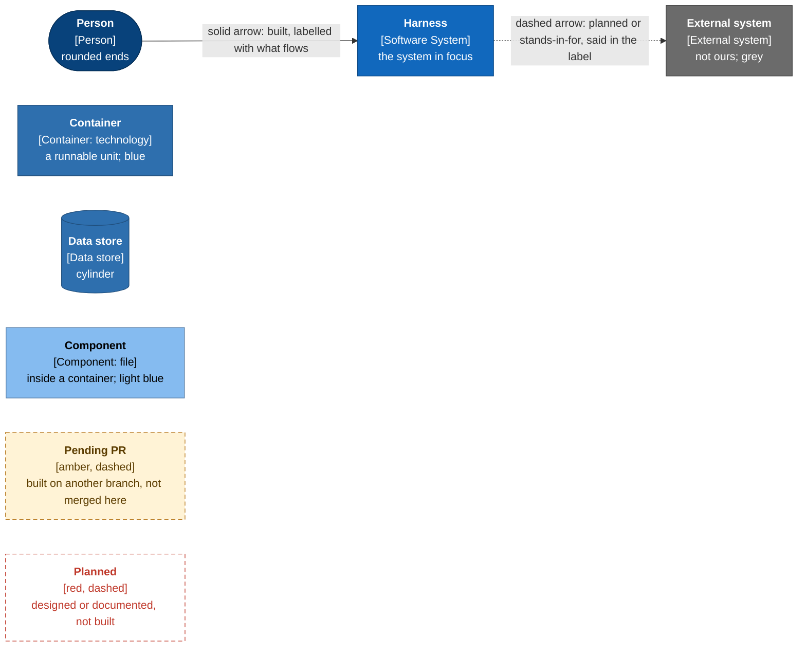

# Architecture of the Tutors release harness

C4 diagrams of the harness for a new maintainer, a reviewer, or the owner
presenting it. They answer four questions without opening the source: what the
system is, who uses it, what it is built from, and how a run flows.

Every box, arrow and label was traced to code or a document in this repository.
Each page ends with an **Evidence** table naming the file for each claim, so a
reviewer can check a diagram in a minute. Where something is planned, or is
built somewhere other than this branch, the diagram says so with a style, never
as fact (see the [legend](#legend)).

## What the harness is, in one paragraph

The harness runs a Tutors release candidate beside the production image, drives
the same scripted traffic through both, normalises the noise, diffs everything
observable (DOM, screenshots, network, headers, accessibility, timing, metrics,
logs, persistence writes, image contents, container posture, startup time) and
fails unless every difference is claimed by a changelog entry or a Rule. It
consumes the monorepo's signed images from Quay by tag or digest, verifies each
signature with cosign before judging anything, and knows nothing of the
monorepo's source except through a loud build-from-ref fallback. It is a
command-line tool (`harness`) that runs the same on a laptop as on GitHub
Actions; the workflows are thin wrappers that add scheduling, dispatch, and a
place to keep the noise history and release records. It gates a release only
while its own A/A run is clean, fresh and verified. Otherwise the same findings
are a warning. Its own signal is ten planted regressions (mutants) it must
catch.

## How to read the set

| Page | C4 level | Read it to learn |
| --- | --- | --- |
| [01-system-context.md](01-system-context.md) | 1, System Context | Who uses the harness and which outside systems it touches, and what flows between them |
| [02-containers.md](02-containers.md) | 2, Container | What runs (CLI, stacks, browser, k6) and what stores state, on a machine and on GitHub |
| [03-components-pipeline.md](03-components-pipeline.md) | 3, Component | Inside the CLI: the run pipeline, capture, compare-claim-gate, image acquisition, the local ops layer |
| [04-dynamic.md](04-dynamic.md) | Dynamic | Sequence diagrams: a release candidate, the nightly A/A, post-deploy, a laptop with no GitHub |
| [05-deployment.md](05-deployment.md) | Deployment | The laptop, the CI runner, kind; where each store and secret lives |
| [06-decisions.md](06-decisions.md) | Decisions | The design decisions visible in the code, each with a pointer |

Suggested paths:

- **Ten minutes, to understand it:** 01, the first diagram of 02, the pipeline
  overview in 03, then 04a.
- **Reviewing a change:** 03 for the module a change touches, then 06 for the
  decision it may bend.
- **Presenting it:** 01, 03's pipeline overview, 04a and 04b, then 06.
- **Operating it:** 04b, 04c, 04d and 05.

Level 4 (code) is not drawn. The source is level 4; each level 3 element names
the file that implements it.

## The C4 levels used

| Level | Scope | Notation here |
| --- | --- | --- |
| 1 System Context | the harness as one box, with people and external systems | one diagram |
| 2 Container | a *container* is a runnable unit or a data store: a process, an image, a directory, a branch. It is not a Docker container unless it says so | four diagrams (machine, compose stacks, GitHub side, state stores) |
| 3 Component | inside the `harness` CLI, the one container with real internal structure | five diagrams, each a zoom of the last |

Every element carries a name, a type tag in brackets, a technology where one
applies, and a short description. Every relationship is labelled with what
flows, and the technology in brackets when it matters. A diagram holds about
12 to 20 elements; where more was needed, it was split.

## Why `flowchart`, not Mermaid's native C4 syntax

Levels 1 to 3 use Mermaid `flowchart` with C4-style classes and subgraphs, not
`C4Context` / `C4Container` / `C4Component`. The reasons:

1. Mermaid's own documentation marks its C4 diagram type as experimental.
2. Native C4 lays elements out in fixed rows with no control over placement, and
   relationship labels overlap once a diagram has more than a handful of arrows.
   These diagrams have up to 25.
3. A legend that distinguishes built, pending and planned needs a per-element
   dashed style, which `flowchart` classes give directly.

The native syntax was not tried on GitHub, so this is a judgement about
control, not a measured failure. `sequenceDiagram` is used for the dynamic views
because it is the natural form there.

## Legend

Colours follow the usual C4 palette. Shape carries the type as well, so a
diagram survives being printed in grey.



| Style | Meaning |
| --- | --- |
| solid box, solid arrow | built and present in this branch (`feat/contract-1.3.0`, commit `164963a`) |
| **amber dashed box** | **pending PR:** built on `feat/harness-1.2.1-followups`, not yet merged into this branch. Drawn because the diagrams show the system as it will be once that lands |
| **red dashed box or arrow** | **planned, not built.** The code has a seam or a document describes it, but nothing runs |
| dashed grey arrow | a relationship that is not a call: "stands in for" (a stub impersonating a service) |
| grey box | external: not part of the harness |

### What "pending PR" contains

Read with `git show feat/harness-1.2.1-followups:<path>`; none of it is in this
branch yet.

- **The `time` app joins the stack.** `APPS` becomes `reader, catalogue, live,
  time` (`src/image-ref.ts`), with `time-a` and `time-b` in
  `compose.harness.yaml` on host ports 3104 and 3204, NodePorts 30103 and 30203
  (host 4103 and 4203) on kind, and the `metrics`, `logs`, `runtime`, `startup`
  and image artefacts. No journey drives it. Marked **"time app: pending PR"**.
- **Corrected Mann-Whitney statistics** in a new `src/compare/stats.ts`
  (`erfc`-based normal CDF, `smallestAttainableP`). The version in this branch
  (`src/compare/engines.ts:252`) has the wrong CDF argument; the timing, load
  and startup engines will import the new module. The nightly and release
  default for `--runs` goes from 3 to 5.
- **A wider engine-path guard**: `ENGINE_PATHS` in `src/ci/engine-change.ts`
  grows to cover collectors, runtime, substrates, fixtures, traffic and the
  lockfile, and a test fails when a new top-level entry is classified as
  neither engine nor non-engine.

Diagrams that mention timing statistics say "Mann-Whitney" and note where the
corrected module lands; diagrams do not draw two versions.

### Not built, anywhere

- **A message bus and its stub.** The monorepo plans a bus. The harness ships
  the seam (`src/bus/transport.ts`) and one transport, `http-recorder`, but no
  `fixtures/bus/` stub exists, and with `HARNESS_BUS` unset the collector says
  "not collected" (`docs/bus.md`). Drawn red-dashed.
- **Posting the report on a pull request.** The harness never does this by
  design (`docs/contract.md`, "What the harness does to a pull request"); it
  writes `report.md`, shaped as a comment, to the job summary and an artifact.
  Posting it is meant to be the monorepo's job, but no workflow on the
  monorepo's `origin/main` does it either (a search for `report.md`, comment
  APIs and `gh pr comment` finds nothing relevant). Nobody posts it today.
- **A boot probe as an arbitrary UID** (what OpenShift's restricted-v2 assigns),
  named as "not built yet" in `docs/modes.md`.

### Built on the monorepo side (merged to `tutors-mono-repo` main)

All of this is built and drawn solid. Read from `origin/main` of `tutors-sdk/tutors-mono-repo`
at `c14c3ee` (merge of #308). The diagrams show only what the harness sees of it;
they are not a monorepo architecture document.

| What | Where in the monorepo | PR |
| --- | --- | --- |
| `deploy.yml`: verifies the overlay pins against the registry and signature, then, in the `production` environment, sets `HARNESS_PRODUCTION_TAG` on the harness repository and dispatches `deployed` with `production` and `digests`. | `.github/workflows/deploy.yml` | #298 |
| Overlays pinned by digest (`newTag` beside `digest`), `pnpm deploy:pin`, `pnpm check:deploy-pins` | `deploy/k8s/overlays/*`, `scripts/deploy-pin.ts`, `scripts/checks/deploy-pins.ts` | #298 |
| `image-build.yml` is the only image publisher (`images.yml` removed) | `.github/workflows/image-build.yml` | #305 |
| The final tag **promotes** the judged `X.Y.Z-rc.N` digest instead of rebuilding; an app that cannot be promoted is rebuilt with a `REBUILT` warning (or fails, with `require_promotion`) | `scripts/promote-image.ts` | #303 |
| `pnpm release:harness`: builds the `release-candidate` payload from a local clone and can run the harness's `local gate`, `local watch --once` or `local nightly`. `release-dispatch.yml` still builds its payload with `gh api` and `jq`, and a test holds the two to the same fields | `scripts/release-harness.ts` | #307 |
| `pnpm release:rules`: writes `rules.json`, the file behind the `rules_url` dispatch field and `rule:` claims | `scripts/release-rules.ts` | #308 |
| EARS Rule ids and `pnpm release:claims:draft`, which drafts claim stubs from the Rules that changed | `scripts/release-claims-draft.ts` | #301 |
| `pnpm check:migrations` and changelog artefact hints for claims | `scripts/checks/migrations.ts`, `CONTRIBUTING.md` | #300 |
| Build identity on one endpoint, `GET /version`; `HARNESS_NOW` frozen clock | `scripts/checks/build-identity.ts` | #296 |
| JSON logs and an `x-request-id` per request | the apps | #297 |

Still on the monorepo's side of the line and not drawn as harness code: the
OpenShift overlays (`deploy/k8s/variants/openshift`) and their conformance check.
The harness does not use them (see [Out of scope](#out-of-scope)).

### Out of scope

**OpenShift is out of scope** (`docs/local.md`, line 13: "OpenShift is out of
scope. The compose and kind substrates are what runs."). The kind substrate
stands in for a cluster with the same admission policy (`restricted` Pod
Security Admission); it does not rehearse Routes, the router's headers or
arbitrary-UID assignment (`deploy/kind/README.md`).

## Doc drift found

The diagrams follow the code. These documents in the harness repository disagree
with it. They were **not edited**; this list is for the owner to fix.

| # | Document says | Code says |
| --- | --- | --- |
| 1 | `README.md`, "Where to stop": "Twelve journeys" | `traffic/journeys/journeys.ts:199` lists six journeys in three sets (`harness journeys` prints them) |
| 2 | `mutants/README.md`: two of the ten mutants ("a lab page that writes a row for anonymous users" and "a navigator with a broken focus order") "need source access" and are not built | `mutants/mutants.yaml` lists `anon-write` and `focus-order` among the ten, and `mutants/wrap.mjs` plants them at the HTTP edge |
| 3 | `docs/images.md` and `docs/local.md` count three apps ("Both are three images", 13 host ports) | true in this branch; four apps (`time`) and 15 host ports once `feat/harness-1.2.1-followups` lands. `docs/local.md` line 49 ("the 13 host ports") and `docs/images.md` line 4 need the change with it |

Also stale since the monorepo work above merged (found while updating, and
not part of the original three):

| Document says | Now |
| --- | --- |
| `docs/local.md` parity rows R1, R2 and P1: "Open (monorepo)", "the monorepo has no local trigger" | `pnpm release:harness` (#307) is the local trigger; `docs/local.md` "What the monorepo would need to change" items 1 and 2 are done |
| `docs/monorepo/README.md`, "First day on Quay" step 5: "Until the monorepo has a deploy job (plan items M11/M12), this variable is updated by hand" | `deploy.yml` (#298) sets it and dispatches `deployed` |
| the monorepo's `guides/Release-Strategy.md` says the harness "reads no field" of `deployed` and lists digests as "not yet closed" | harness contract 1.3.0 reads both (`src/release-record.ts`). That guide is the monorepo's, noted for completeness |

## Keeping them true

Each Mermaid block was parsed with `@mermaid-js/mermaid-cli` (`mmdc`, Mermaid
11.17) against a headless Chrome, and rendered to SVG, as part of writing these
pages. To re-check after editing:

```bash
# from a scratch directory
npm install @mermaid-js/mermaid-cli   # set PUPPETEER_SKIP_DOWNLOAD=1 and pass -p with executablePath
# extract each ```mermaid block to a file and run: mmdc -i block.mmd -o block.svg -p puppeteer.json
```

A change to what the harness does that alters a diagram should change the
diagram in the same PR. The contract (`docs/contract.md`) is held to the code by
`tests/contract.test.ts`; these diagrams are not, so the Evidence tables are
the way to re-verify one.
